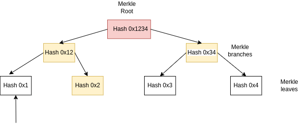

# Day 1

# Merkle Trees

Fundamentally, they are a hierarchical set of hash values that are constituted from actual data (leaves) to intermediate hashes (branches) and go up to the Merkle root that summarizes all the data in one hash value. This gives us the power to know if the data we received is valid for that Merkle tree or not.

Note: This data structure follows a log(n) behavior.

  

Example: Let's say that we receive the hash 0x1 and we want to know if it's part of the Merkle tree. In order to do this, we need to compute the Merkle root. For this, we need the neighbor hashes, as the image explains.

# Ethereum 2.0 Technical Overview

## Consensus

Consensus is a way to build reliable systems with unreliable components. Blockchain systems aim to agree on a single transaction history. Proof of Work (PoW) and Proof of Stake (PoS) are not consensus protocols, but they enable consensus protocols. Many blockchain consensus protocols are "forkful." In a "safe" protocol, nothing bad ever happens. In a "live" protocol, something good always happens. No practical protocol can always be safe and live.

## Introduction

Ethereum is composed of individual nodes that can behave well or poorly, so the work of the consensus is to maintain and agree on the state of the chain and back this agreement with the good nodes that are in the chain. When talking about consensus protocols, we have:

  
Ethereum 2 -> Casper FFG, LMD GHOST -> Gasper

## Byzantine Generals

In order to build a distributed, reliable system, we need to have a consensus; otherwise, we cannot guarantee data integrity. Here's a good example of why we need it.

First, we need to understand that each node of the chain has its own view, meaning that the state may vary. Despite this, we need to reach an agreement. The first solution for this problem was Practical Byzantine Fault Tolerance (PBFT). The problem is that it's not forkful. Nakamoto Consensus -> PoW is forkable, but it isn't always secure.

## Proof of Stake and Proof of Work

They are enablers for consensus protocols and are Sybil resistance mechanisms that place a cost on participating in the protocol. This prevents attackers from participating at low or zero cost. They are tied to the fork choice rule of the consensus mechanism that they support.

## Fork Choice Rule

Considering network problems such as messages received out of order and malicious peers, it leads us to have different views of the network state. In the end, we want to have an agreement despite these problems; that's when the rule comes into play.

Given a block and some decision criteria, the rule is designed to select, from all available branches, the one that is most likely to eventually end in the final, linear, canonical chain.
