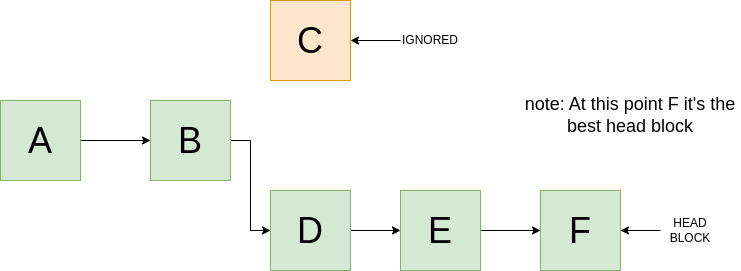
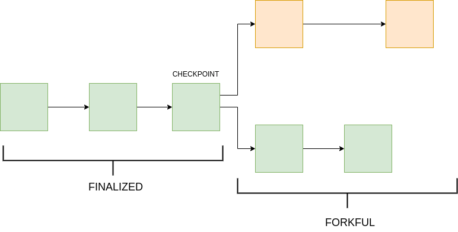

# Final Linear Canonical Chain:
It refers to the main version of the blockchain that nodes agree on. The term "linear" implies that it's a continuous sequence of blocks.

**Note: That's what the fork choice rule does; it does not pick branches that will be discarded.**

The rule chooses the block at the tip of a branch, called the head block. For any correct node, this block needs to be valid according to the protocol's rules, and all its children must pass this filter.

**Examples of fork choice rules:**

* In proof of work, Ethereum and Bitcoin use the "heaviest chain rule." This means that the most recent block, representing the most work, is considered the head of the chain.

* In proof of stake, Ethereum uses the Casper FFG protocol, which has a rule called "follow the chain continuing the justified checkpoint of the greatest height." This means that nodes should choose the chain with the highest justified checkpoint.

* The Ethereum proof of stake LMD GHOST protocol uses the "Greediest Heaviest Observed Subtree" rule. This rule looks at the votes from validators for blocks and their children, and chooses the block with the most votes.

Ethereum 2.0 combines the LMD GHOST protocol and the Casper FFG consensus mechanism. The LMD GHOST protocol validates blocks and determines the main chain, while Casper FFG adds finality to the consensus.

# What is a checkpoint?
A checkpoint is a specific block that has been proposed and voted on by validators (the PoS equivalent to miners). A checkpoint becomes "justified" when it receives a supermajority of votes (e.g., ⅔ of all validators' votes). This introduces another concept: "Never revert a finalized block." A block is considered finalized when the checkpoint is justified, and the next checkpoint is finalized too. This means that there's a high degree of certainty that this block has been agreed upon by the validators of the network.

An analogy for the fork choice rule is that this rule assigns a numeric score to a block. The winning block, the head block, has the highest score. This enables nodes with different views on the chain to agree on which branch they need to follow. All correct nodes will eventually agree on a common view of a single canonical chain going back to Genesis.

# Reorgs and reversions:
As a node receives new blocks (under PoS, new votes for blocks), it will reevaluate the fork choice rule in light of new information. A new block will be a child of the block that is currently viewed as the head block (as long as it's valid).

Sometimes the new block might be a descendant of another block in the block tree. If the nodes don't have the parent node of the new head block, they will ask for it from their peers.

In this case, running the fork choice rule on the updated block tree might indicate a head block that's in another branch. When this happens, the node must perform a reorg, also known as a reversion. It will remove blocks that it had previously included in its chain and adopt the new head block of the other branch.

  
   
  <small>Fig1. Block propagation.</small>

**Scenario:**
Let's assume that we have another block G that exists in the branch of C. Normally, we would ignore it, but in this case, the fork choice rule selects the G block as the best choice for the new head block. Then the blocks DEF need to be reverted.

**Note: Short reorgs of one to two blocks are very common in Ethereum due to network delays in block propagation.**

Much longer reorgs should be rare, unless the chain is under attack or there's a bug in the client implementation of the fork choice rule.

# Safety:
An algorithm is safe if "nothing bad ever happens," such as double-spending coins or finalizing two conflicting checkpoints.

Consistency: This refers to the idea that if we ask two different honest nodes the state of the chain, we should get the same answer. So, safety means that our distributed system "behaves like a centralized implementation that executes operations atomically, one at a time."

# Liveness:
An algorithm is said to be alive if "something good eventually happens." In blockchain, this refers to the chain always being able to add a new block and never being unable to produce a block with transactions.

"Availability" is another way to look at this, meaning that if I send a valid transaction, it will eventually be included in the state.

# We can't have all:
The CAP theorem is a famous result in distributed systems theory, stating that no distributed system can have:

* Consistency
* Availability
* Partition tolerance

Partition tolerance is the ability to function when communication between nodes is not reliable.

**Example**:
A network fault might split the nodes into groups that can't communicate with each other. This can happen due to country firewalls or if a cloud computing service goes down, causing all the nodes hosted there to become an independent group with no communication with the outside world. Now we've lost consistency between all nodes and safety. To avoid this, we would need group A to stop processing transactions, but now we've lost availability and, therefore, liveness.

So, the CAP theorem states that we cannot hope to design a system that is both safe and live under all circumstances, as we have no other option but to operate on an unreliable network (the internet).

# Ethereum liveness:
In Ethereum, if a group is divided, it will continue to produce blocks but will lack finality (a safety property). Depending on the proportion of the stake managed by each side, either one side or neither side will continue to finalize blocks.

Unless the partition is resolved, both sides will regain finality due to the inactivity leak mechanism, but this leads to failure because each chain will finalize a different history and become irreconcilable and independent forever.

Because of this, exchanges usually use a proxy for safety that requires waiting for a certain number of blocks to be built on top of the transaction in order to consider it final, but that's only a statistical guarantee.

# Conclusion:
Ethereum prioritizes liveness, but unlike proof of work, it also offers a safety guarantee under favorable circumstances.

Safety in Ethereum is called "finality," and it's delivered by the Casper FFG mechanism. The idea is that all honest nodes will agree on blocks that they will never revert (checkpoints), and all their ancestor blocks are considered "final." You can consult any node, and you will get the same answer. Finality is a safety property: once finality has been conferred, nothing bad ever happens, as we mentioned before.

  
   
  <small>Fig2. Checkpoints in the chain.</small>

Finality in Ethereum 2.0 is an "economic finality" because, while it's theoretically possible to finalize two conflicting checkpoints, the cost associated with such an event is so high that it becomes extremely unlikely. This serves to incentivize nodes to behave well and avoid penalties.
